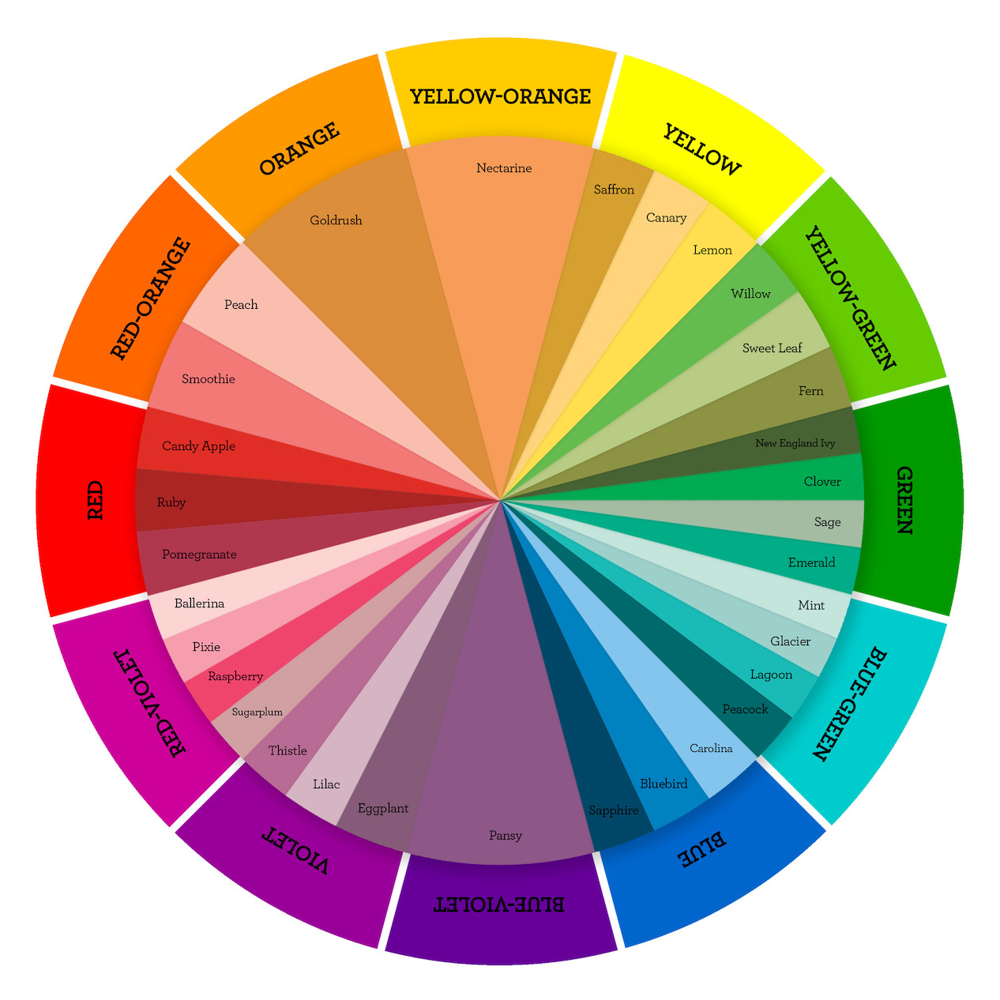
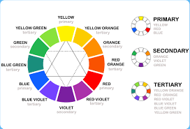

# Responsive Design Notes & Code Snippets

## Text-Transform Properties

Value - Result
`lowercase` -	"transform me"
`uppercase` -	"TRANSFORM ME"
`capitalize` -	"Transform Me"
`initial`	- Use the default value
`inherit` -	Use the text-transform value from the parent element
`none` -	Default: Use the original text

## Applied Visual Design
* **Complementary Colors:** Color theory and the impact on design
* [Color Wheel and Color Theory: Canva](https://www.canva.com/colors/color-wheel/)


```
red (#FF0000) and cyan (#00FFFF)
green (#00FF00) and magenta (#FF00FF)
blue (#0000FF) and yellow (#FFFF00)
```

* **Adjust Hue of a Color:** `hsl()` - hue, saturation, lightness
hue = 'color' - on Spectrum of colors - 0-360
saturation = amount of gray - full saturated = no gray = 100%
lightness - amount of white or black - 0% (black) - 100% (white) 
```css
Color: 	HSL
red:	hsl(0, 100%, 50%)
yellow:	hsl(60, 100%, 50%)
green:	hsl(120, 100%, 50%)
cyan:	hsl(180, 100%, 50%)
blue:	hsl(240, 100%, 50%)
magenta:	hsl(300, 100%, 50%)
```
Notes: Cool way to change quite great looking colors schemes quickly

* **Linear Gradients:** `background` property w/ `linear-gradient()` function
```
background: linear-gradient(gradient_direction, color 1, color 2, color 3, ...);

background: linear-gradient(90deg, red, yellow, rgb(204, 204, 255));
```

The `repeating-linear-gradient()` function is very similar to `linear-gradient()` with the major difference that it repeats the specified gradient pattern. `repeating-linear-gradient()` accepts a variety of values, but for simplicity, you'll work with an angle value and color stop values in this challenge.

The angle value is the direction of the gradient. Color stops are like width values that mark where a transition takes place, and are given with a percentage or a number of pixels.

In the example demonstrated in the code editor, the gradient starts with the color `yellow` at 0 pixels which blends into the second color `blue` at 40 pixels away from the start. Since the next color stop is also at 40 pixels, the gradient immediately changes to the third color `green`, which itself blends into the fourth color value `red` as that is 80 pixels away from the beginning of the gradient.

For this example, it helps to think about the color stops as pairs where every two colors blend together.

`0px [yellow -- blend -- blue] 40px [green -- blend -- red] 80px`

If every two color stop values are the same color, the blending isn't noticeable because it's between the same color, followed by a hard transition to the next color, so you end up with stripes.
```css
  div{
    border-radius: 20px;
    width: 70%;
    height: 400px;
    margin:  50 auto;
    background: repeating-linear-gradient(
      90deg,
      yellow 0px,
      blue 40px,
      green 40px,
      red 80px
    );
  }

    div{
    border-radius: 20px;
    width: 70%;
    height: 400px;
    margin:  50 auto;
    background: repeating-linear-gradient(
      45deg,
      yellow 0px,
      yellow 40px,
      black 40px,
      black 80px
    );
  }
  ```

  * **Transform Property:**
  ```css
    transform: scale()

    p:hover {
      transform: scale(2);
    }
  ```
  * skewX = (horizontal) X axis by a given degree
  * skewY() =along the Y (vertical) axis.
  ```css
    transform: scewX()

    p {
      transform: skewX(-32deg);
    }  
  ```
* **CREATE GRAPHICS:** manipulate different selectors and properties. i.e. w/ `box-shadow` using `blur-radius` and `spread-radius`
* using `before::` and `after::` - use to create heart - for function properly they must have a defined `content` property - add photo or text to selected element || set to empty string for shapes 
* **animations:** `@keyframes` = what happens during animation || `animation-name` = name used by `@keyframes` || `animation-duration` = length of time for the animation
