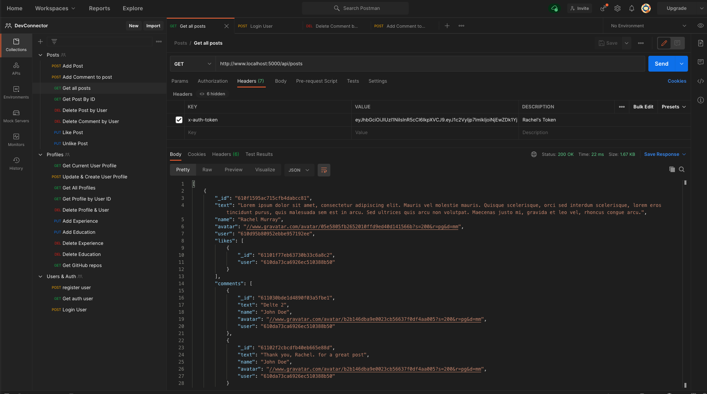

# 100 Days Of Code - Log

<hr>

- **Template**

### Day #: March #, 2021

##### Activities

- **Today's Progress:**
- **Thoughts:**
- **Link to work:**
- **Tweet:**
- **LinkedIn:**

<hr>

### Day 0: March 1, 2021

##### Free Code Camp Responsive Web Design

- **Today's Progress**: Getting Coding Brain Active Again with BACK TO THE BASICS using Free Code Camp Challenges. I learned to create your own CSS properties by creating the value using -- `--penguin-skin: gray` and reference it for other properties `background: var(--penguin-skin)`
- **Thoughts:** I really like the way Free Code Camp is set up to make me code. All coming back pretty quickly and remembering little tricks and stuff. This will be engrained in my brain!!!
- **Link to work:** Free Code Camp Challenges | [HTML & HTML5 | Basic CSS](https://www.freecodecamp.org/learn/responsive-web-design/))
- **TWEET:** Yes
- **LinkedIn:** Yes

### Day 1: March 2, 2021

##### Free Code Camp Responsive Web Design Cont

- **Today's Progress:** MORE Free Code Camp Challenges. Getting my Brain Muscles working. Refreshed on early Positioning. Good to understand these properties. But FlexBox on other libraries allow us to better structure our code when we start writing our own big projects.
- **Thoughts:** Need to really work my head around `relative` and `absolute` and `fixed` positioning. Doing good on inheritance. Similar to functions and how it matters what inherits what and how code is going to read and affected by the order. If using position `absolute` make sure parent element position rule to parent element, usually `relative`. `fixed` does not move when user scrolls. `sticky` - last one. `z-index` to create stack order for elements on top of each other (i wonder what new tech is used for that now). `margin: auto` = item center, `display: block` = img no longer inline
- **Link to work:** N/A: Free Code Camp Challenges | [Applied Visual Design](https://www.freecodecamp.org/learn/responsive-web-design/)
- **Tweet:**
- **LinkedIn:** No - Only for Real Big Projects and News

### Day 2: March 3, 2021

##### More Free Code Camp - Responsive Web Design

- **Today's Progress:** Created simple website to start putting snippets for graphic and animations I'm learning to do with CSS
- **Thoughts:** Creating from scratch and coding is fun!! Hoping that creating this site and putting my notes into an actual website will help with remember what is available at my finger tips without having to import a ton of libraries
- **Link to work:** [GITHUB PAGES](https://dcbeergoddess.github.io/free-code-camp-snippets/) || [GITHUB REPO](https://github.com/dcbeergoddess/free-code-camp-snippets)
- **Tweet:** YES
- **LinkedIn:** NO

### Day 3: March 4, 2021

##### Right Accessible Code

- **Today's Progress:** After a few challenges on Free Code Camp under Applied Accessibility and review of best practices for Screen Readers I started a page for my Yarn Projects to illustrate best practices. HTML5 introduction better semantic tags like nav, main, article you can see used throughout React and CSS Libraries like bootstrap.
- **Thoughts:** Started a skelton html page that I want to develop into a full blow marketing page for my future designs. Good to start full page from scratch and run into the stupid mistakes like not linking pictures right.
- **Link to work:** [Yarn Projects Page](https://dcbeergoddess.github.io/free-code-camp-snippets/pages/accessibility.html)
- **Tweet:** Yes
- **LinkedIn:** No

### Day 4: March 5, 2021

##### Style and Organize my Snippets Website

- **Today's Progress:** Set up a more streamline design and bootstrap elements to the snippets website
- **Thoughts:** Enjoyed using some of the skills I just learned again and went ahead to play around with Bootstrap which came pretty quickly and remmbered all the link that were required after running into issues with the nav bar not working.
- **Link to work:** [Snippets Website Updated](https://dcbeergoddess.github.io/free-code-camp-snippets/)
- **Tweet:** YES
- **LinkedIn:** NO

### Day 5: March 6, 2021

##### Bootstrap Cards and more

- **Today's Progress:** Getting back into the bootstrap swing of things, added google fonts
- **Thoughts:** CSS can be a mother fucking bitch, looking better on the webpage
- **Link to work:** [Cards on Responsive Web Page](file:///Users/dcbeergoddess/Documents/free-code-camp-snippets/pages/responsive-web-design.html)
- **Tweet:** YES
- **LinkedIn:** NO

### Day 6: March 7, 2021

##### Accessibility Review and Tribute Page on Free Code Camp

- **Today's Progress:** Went through the rest of the Applied Accessibility section in Free Code Camp and went on to finish the first challenge in the Responsive Web Design Section by building a Tribute Page in Code Pen for Rubber Duck Decoding
- **Thoughts:** Really cool stuff you can do for colorblindness and more on color!!!
- **Link to work:** https://codepen.io/dcbeergoddess/pen/oNYavpe
- **Tweet:** YES
- **LinkedIn:** NO

### Day 7: March 8, 2021

##### FlexBox - Tweet Clone

- **Today's Progress:** Went through FlexBox coding and will continue tomorrow. Updates website, Twitter/Tweet Page with info from exercises
- **Thoughts:** FlexBox Principles again!!! Main axis and cross axis. Display Help. Going to test my yarn projects tomorrow in FlexBox
- **Link to work:** [TWEET FLEXBOX FUN](https://dcbeergoddess.github.io/free-code-camp-snippets/pages/twitter.html)
- **Tweet:** NO - More FlexBox in Day 8: Tweet Two Days
- **LinkedIn:** NO - WEEK UPDATE NEEDED

### Day 8: March 9, 2021

##### Flex-box updates to Yarn Project Page

- **Today's Progress:** Made updates to the Project Page, using it as a brainstorm page for how I want to organize my bigger project later down the road.
- **Thoughts:** Flex-box working well. Soon need to add data base so I can plug in info and have it generate
- **Link to work:** [YARN PROJECTS WITH FLEXBOX](https://dcbeergoddess.github.io/free-code-camp-snippets/pages/accessibility.html)
- **Tweet:** YES
- **LinkedIn:** YES

### March 10th - DAY OFF - Tutorial/Colt Day Only - MIND TIRED

### Day 9: March 11th, 2021

##### ASYNC JavaScript and Promises

- **Today's Progress:** Followed Along with Colt's tutorial and started playing around with old projects that had API's. Want to build new API with third party for practice today and tomorrow
- **Thoughts:** BRAIN HURTSSSSS - NEED to get my head super wrapped around these concepts to really drive home the backend that I've been working with in past projects
- **Link to work:** N/A
- **Tweet:** NOT TODAY
- **LinkedIn:** NOT TODAY

### Day 10: March 12th, 2021

##### XMLHttp, Fetch, APIs

- **Today's Progress:** Played on Postman to follow along with Colt. Start to build my own API an try out another Crypto to play around with fintech stuff :)
- **Thoughts:** APIs coming back to me real quick. Need to go back and update some homework stuff to fix what I never got going. Maybe fix Covid website to
- **Link to work:** [BTC API](https://www.cryptonator.com/api), [CRYPTO API](https://docs.coinapi.io/#md-docs), [DAD JOKES API](https://icanhazdadjoke.com/api)
- **Tweet:** YES
- **LinkedIn:** NO

### Day 11: March 13th, 2021

##### OBJECT ORIENTED PROGRAMMING

- **Today's Progress:** Good Review of OOP and CLASSES
- **Thoughts:** This is where I have struggled in past but really coming home to me know
- **Link to work:** n/a
- **Tweet:** NO
- **LinkedIn:** NO

### Day 12: March 14th, 2021

##### NODE.JS and BACKEND

- **Today's Progress:** BACK INTO THE BACKEND!!!
- **Thoughts:** review on terminal and backend. created node.js application to build a language guesser you can use in the command line
- **Link to work:** [LANGUAGE GUESSER](https://github.com/dcbeergoddess/language_guesser)
- **Tweet:** YES
- **LinkedIn:** NO

### Day 13: March 15th, 2021

##### NODE.JS AND EXPRESS

- **Today's Progress:** MORE BACKEND!!! REVIEWING EXPRESS, Learning EJS as Templating tool. Familiar with handlebars
- **Thoughts:** review on express and starting servers easy, getting back into new templating tool will be cool. MORE FULL WEBSITES
- **Link to work:** COLT REPO
- **Tweet:** NO
- **LinkedIn:** NO

### Day 14: March 16th, 2021

##### NODE.JS AND EXPRESS

- **Today's Progress:** CRUD!!!!!!! RESTful APIs
- **Thoughts:** reviewing routes and CRUD Pattern to make RESTful APIs
- **Link to work:** COLT REPO - COMMENTS
- **Tweet:** YES
- **LinkedIn:** NO

### Day 15: March 17th, 2021

##### BUILDING NOTE TAKER APP WITH FULL CRUD AND EJS

- **Today's Progress:** CRUD!!!!!!! Going back to hold homework from bootcamp. Going to take the notetaker example and serve it up using ESJ instead.
- **Thoughts:** Coding to review everything I've been absorbing over the weekend.
- **Link to work:** https://github.com/dcbeergoddess/notetaker_express_ejs
- **Tweet:** YES
- **LinkedIn:** NO

### Day 16: March 18th, 2021

##### BUILDING NOTE TAKER APP WITH FULL CRUD AND EJS

- **Today's Progress:** Still building up full CRUD, got post to work and thought i had new post submitting but now the forms will not work. going to debug tomorrow
- **Thoughts:** UGHUGHUGHGUHGUGHGUGHGUGH... I'm getting there
- **Link to work:** https://github.com/dcbeergoddess/notetaker_express_ejs
- **Tweet:** No
- **LinkedIn:** NO

### WEEKEND BREAK FOR BEER LEAGUE MARCH 19th - 21st

### Day 18: March 22nd, 2021

##### Databases

- **Today's Progress:** Reconnecting MongoDB on the Computer
- **Thoughts:** THIS IS GONNA SUCK
- **Link to work:** Mongo Setup
- **Tweet:** NO
- **LinkedIn:** NO

### Day 19: March 23rd, 2021

##### Databases - Mongoose

- **Today's Progress:** Revisiting CRUD operations in Mongoose
- **Thoughts:** It's all coming back to me now
- **Link to work:** N/A - Mostly command line playing around
- **Tweet:** YES
- **LinkedIn:** NO

### Day 20: March 24th, 2021

##### Databases - Mongoose

- **Today's Progress:** More fun with Mongoose ORM/ODM Models --> Validations and Schemas --> Models and example products
- **Thoughts:** Still coming back pretty well.
- **Link to work:** NOTES IN WEB DEV REPO
- **Tweet:** N)
- **LinkedIn:** NO

### Day 21-22: March 25th-26th, 2021

- **Today's Progress:** Research for coding jobs --- algorithm ---
- **Thoughts:** Feeling confident about skills
- **Link to work:** NOTES IN WEB DEV REPO
- **Tweet:** N0
- **LinkedIn:** NO

### Day 23-26: March 28th-March 31st, 2021

- **Today's Progress:** CRUD MONGOOSE AND EXPRESS
- **Thoughts:** Finally Creating a FULL CRUD APPLICATIONS
- **Link to work:** NOTES IN WEB DEV REPO
- **Tweet:** N0
- **LinkedIn:** NO

### DAY 27: April 1st, 2021

- **Today's Progress:** Finished working on Product FarmStand App with full CRUD functionality. I fixed some things like creating a function to uppercase the first letter of the Category when you display the category in the title.
- **Thoughts:** Finally Created a FULL CRUD APP!!!!! Now I just need
- **Link to work:** [PRODUCT SECTION IN COLT STEELE](https://github.com/dcbeergoddess/webdev_2020_coltsteele/tree/main/42_DATABASE_EXPRESS_MONGOOSE) --> FIGURE OUT HOW TO MAKE LINK WORK
- **Tweet:** N0
- **LinkedIn:** NO

### Day 28: April 2nd, 2021

##### Dc Hook && Coder Designs

- **Today's Progress:** STARTED MY WEBSITE
- **Thoughts:** EXCITED
- **Link to work:** [GitHub dcHooknCoderDesigns](https://github.com/dcbeergoddess/dcHooknCoderDesigns)
- **Tweet:** YES
- **LinkedIn:** No

### Day 29: April 3rd, 2021

##### Dc Hook && Coder Designs

- **Today's Progress:** Finished up some CRUD functionality to have the basics started. Trello Board set up with all steps to go along to build a full stack application with the right authentication and security.
- **Thoughts:** Going well so far!!! looking forward to building this out!
- **Link to work:** [Trello Board](https://trello.com/b/6PteyvaW/dc-hook-coder-designs)
- **Tweet:** NO
- **LinkedIn:** No

### Day 30: April 4th, 2021

##### Dc Hook && Coder Designs

- **Today's Progress:** Added more CRUD functionality to the app.
- **Thoughts:** No big issues thus far. following along as I work on project for yelp-camp simultaneously to get all info injected in my brain
- **Link to work:** [Trello Board](https://trello.com/b/6PteyvaW/dc-hook-coder-designs)
- **Tweet:** NO
- **LinkedIn:** No

### Day 31: April 5th, 2021

##### Dc Hook && Coder Designs

- **Today's Progress:** FULL CRUD FUNCTIONALITY --> Intro to creating middleware for app
- **Thoughts:** YAAYAYYAYAYAYAYAYAY
- **Link to work:** [Trello Board](https://trello.com/b/6PteyvaW/dc-hook-coder-designs)
- **Tweet:** YES
- **LinkedIn:** No

### Day 31: April 6th, 2021

##### Dc Hook && Coder Designs

- **Today's Progress:** Learning basic styles from new BOOTSTRAP5!, no longer dependent on jQum, ejs-mate for boilerplate help, setting up boilerplate partials, using api from unsplash to generate images
- **Thoughts:** Image generator kind of cool. had issues with promises in my seeds folder but all fixed now!!! Kept getting Topology error because I was closing the connection before data was done seeding. Fun of async and await - They have a CIVIL RIGHTS COLLECTION --> FUTURE FIXES ON PROJECTS
- **Link to work:** [Unsplash API](https://source.unsplash.com/)
- **Tweet:** YES
- **LinkedIn:** No

### Day 32: April 7th, 2021

##### Error Handling in Express

- **Today's Progress:** Working on learning best practices for handling errors in express.js especially in regards to async functions
- **Thoughts:** getting to the important shit. ERRORS!!!!!
- **Link to work:** N/A
- **Tweet:** No
- **LinkedIn:** No

### Day 33: April 8th, 2021

##### Basic Express Error Handling in dcHooknCoder

- **Today's Progress:** Added some basic error handling to my project including a generic express error class to handle incoming errors from express along with sending mongoose errors to next as well. Need to clean up some messaging but so far some very basic error handling for now and catching async problems
- **Thoughts:** ASYNC-----------------> WE NEED EXPRESS 5
- **Link to work:** dcHooknCoderDesigns repo
- **Tweet:** Yes
- **LinkedIn:** No

### Day 34: April 9th, 2021

##### JOI Schema Validation and MIDDLEWARE!!!! - dcHooknCoder

- **Today's Progress:** Working with JOI, Set up Express Error Page Template to Render, JOI Validating my Project Object in craft website project.
- **Thoughts:** Always better to make sure things work piece by piece. Tried to implement JOI all in one go after coding in tutorial but didn't get it to work right away. The problem was actually I tested wrong in POSTMAN. Probably was working the entire time. But always great practice.
- **Link to work:** dcHooknCoderDesigns repo
- **Tweet:** Yes
- **LinkedIn:** No

### Day 35: April 10th, 2021

##### Databases and Relationships

- **Today's Progress:** Revisiting Mongo and Database Relationships and how the relate to making models and serving them up to express. Using DemoApp about Farms and Products from Colt Steele Code-Along
- **Thoughts:** Keep on getting better and better towards the real deal of making models and relationships in express work!!!
- **Link to work:** webdev 2020 repo
- **Tweet:** No
- **LinkedIn:** No

### DAY OF REST SUNDAY: APRIL 11th, 2021 --> Still did some SQL w/ MIMO APP

### Day 36: April 12th, 2021

##### Adding Complexity

- **Today's Progress:** Creating more complex models in our yelp-camp by coding in a review model and creating one-to-many relationship using ObjectId array in parent model as we think of scalability in the fact that the parent model could have the potential for thousands and thousands of reviews.
- **Thoughts:** doing a review vs comments in my yarn project app
- **Link to work:** webdev 2020 repo
- **Tweet:** No
- **LinkedIn:** No

### Day 37: April 13th, 2021

##### COOKIES

- **Today's Progress:** LEARNING COOKIES AND SETTING UP cookie-parser to verify data has not been tampered with --> `cryptographic signature`. Cookies also are used for tracking data which is why is has become controversial... tracks users web browsing... ugh
- **Thoughts:** Keys to verify the integrity of data is now all starting to make sense when you are getting into crypto and blockchain. curious to see the cross over in certain context
- **Link to work:** webdev 2020 repo
- **Tweet:** No
- **LinkedIn:** No

### Day 38: April 14th, 2021

##### Express - SESSIONS

- **Today's Progress:** LEARNING Express-SESSIONS and how to data store for a user using cookies and keep the data in local memory for now. Did some coding exercises to test out how they work and storing on the server-side to send back to the client to reuse during their session before we restart the server.
- **Thoughts:** Remember having trouble with this in React.JS during organizing for change. I believe we ended up using PassportJS for help. Will go back once the yarn project is done!!!
- **Link to work:** webdev 2020 repo
- **Tweet:** Yes
- **LinkedIn:** No

### Day 39: April 15th, 2021

##### dcHooknCoderDesigns

- **Today's Progress:** Started coding model for comments and adding form to ejs on project show page. will continue with this and post about what I got finished by the end of the day tomorrow.
- **Thoughts:** Going so well so far. had no major problems to debug setting up the easy stuff for now. will make comments model include for items, such as create_by date in future. for now just want to use to test the routes that are coming next
- **Link to work:** dcHooknCoder Repo
- **Tweet:** No
- **LinkedIn:** No

### Day 40: April 16th, 2021

##### SQL on M1M0

- **Today's Progress:** Saw an advertisement on linkedIn for M1M0, it has free exercises to learn HTML/CSS/JAVASCRIPT, PYTHON, and SQL. Yesterday was also vaccine recovery day. Decided to just spend time on the app refreshing myself on SQL syntax, building little projects in the app.
- **Thoughts:** SQL! Great resource without having to be on an IDE!
- **Link to work:** [MIMO APP](https://getmimo.com/)
- **Tweet:** YES
- **LinkedIn:** No

### Day 41: April 17th, 2021

##### dcHooknCoderDesigns

- **Today's Progress:** Finished up the simple COMMENT Model for now to post comments on a project w/ proper JOI and Bootstrap Validation. Using mongoose middleware we can know delete all comments associated with a project.
- **Thoughts:** Want to add user and created_at date && time to comment model later, as the textarea format does not post comment with line breaks even though that is how you typed it in. Shows up with `r/n` in mongo when looking up all comments in the database.
- **Link to work:** dcHooknCoder Repo
- **Tweet:** YES
- **LinkedIn:** No

### Day 42: April 18th, 2021

##### SQL on M1M0

- **Today's Progress:** More SQL syntax refreshment exercises
- **Thoughts:** SQL! Great resource without having to be on an IDE!
- **Link to work:** [MIMO APP](https://getmimo.com/)
- **Tweet:** YES
- **LinkedIn:** No

### Day 43: April 19th, 2021

##### Authentication from "SCRATCH"

- **Today's Progress:** Digging into Password Security, Password Salts, Cryptographic Hash Functions, BCRYPT Hashing Function
- **Thoughts:** Awesome to finally get to learning Authentication for security!!! From Scratch for now, will use `Passport` later in project.
- **Link to work:** Web Dev 2020 Repo
- **Tweet:** YES
- **LinkedIn:** No

### DAY 44: April 20th, 2021

##### More Important Day than to reflect on my own code

- #BlackLivesMatter #OneStepInTheRightDirection --> MY SHIT IS NOT IMPORTANT TODAY!!!

### DAY 45: April 21th, 2021

##### Authentication for YelpCamp

- **Today's Progress:** Setting up basic authentication in YelpCamp --> setting up authorization to attach authors to campgrounds, etc.
- **Thoughts:** It's coming along just fine :)
- **Link to work:** Web Dev 2020 Repo
- **Tweet:** NO
- **LinkedIn:** No

### DAY 46: April 22th, 2021

##### Review Permissions for YelpCamp

- **Today's Progress:** Creating Reviews in YelpCamp Project and working with middleware to protect those routes and associate with user that created them
- **Thoughts:** Always need to build out models and associate models with scalability in mind. Sometime you only need one aspect of a model and just not serve to populate entire model object if you only need one thing like a username
- **Link to work:** YELPCAMP
- **Tweet:** NO
- **LinkedIn:** No

## TOOK BREAK APRIL 24th

### DAY 47 && 48: April 23th && April 25th

##### Implement star reviews for YelpCamp

- **Today's Progress:** worked with Starability-CSS to add to reviews in yelpcamp repo
- **Thoughts:** NEW FUN WAY TO IMPLEMENT COOL CSS FILES!!!
- **Link to work:** YELPCAMP
- **Tweet:** NO
- **LinkedIn:** No

### DAY 49: April 26th, 2021

##### Image Uploads for YelpCamp

- **Today's Progress:** How do we upload files use multer middleware, and saving to cloudinary.com
- **Thoughts:** MORE MIDDLEWARE
- **Link to work:** YELPCAMP
- **Tweet:** YES
- **LinkedIn:** No

## DAY 50: April 27th, 2021

##### Geocoding and MapBox

- **Today's Progress:** introduction to geocoding and adding maps to an application
- **Thoughts:** Using more fun tools instead of having to manually code
- **Link to work:** YELPCAMP
- **Tweet:** YES
- **LinkedIn:** No

## DAY 51: April 27th, 2021

##### MapBox and Cluster Maps

- **Today's Progress:** Learning how to implement a cluster map using mapbox
- **Thoughts:** Using more fun tools instead of having to manually code
- **Link to work:** YELPCAMP
- **Tweet:** YES
- **LinkedIn:** No

## EXTENDED STAY-CATION: PARENTS VISIT April 28th - May 5th, 2021

- When you have not socialized in awhile and have to host your parents in the city in pandemic times can be very exhausting mentally but was able to talk to my parents about what I'm learning and where I want to take it from here whether I can find my way to civic tech, education, or just an entry-level position I can build my skills in.

## DAY 52: May 6th, 2021

##### Common Security Issues

- **Today's Progress:** Diving into some of the packages we can use to develop better security for our applications including packages for express that help sanitize Mongo and extensions we can make to JOI if that is what you are using. And HELMET that helps provide several security application to protect your project.
- **Thoughts:** In bigger applications there is a whole team devoted to this work. But looking forward to diving into some docs and learning more about what I can do for my own personal projects that might start including sensitive information
- **Link to work:** YELPCAMP
- **Tweet:** YES
- **LinkedIn:** No

## DAY 53: May 7th, 2021

##### Heroku and Deployment

- **Today's Progress:** Went along with Colt to learn how to start up Cluster on Mongo Atlas to connect to application and use when we upload to Heroku. Can't wait to try it out on the OFC APP!!!
- **Thoughts:** I AM DONE WITH COLT STEELE WEB DEVELOPER CAMP 2021!!!!!!!!!!!
- **Link to work:** YELPCAMP
- **Tweet:** YES
- **LinkedIn:** YES

## May 8th - 9th, 2021

- Luray, VA Vacation where there was no service and NO TECHNOLOGY!!!!

## DAY 54: May 10th, 2021

##### DC Hook && Coder Designs

- **Today's Progress:** Moving code around for routes and serving up a public folder to hold scripts and stylesheets that we will add on to later!
- **Thoughts:** So far going a long very well
- **Link to work:** DCHooknCoderDesigns Repo
- **Tweet:** YES
- **LinkedIn:** NO

## DAY 55: May 11th, 2021

##### DC Hook && Coder Designs Debugging

- **Today's Progress:** Setting Up Passport and User Authentication... Was having issues getting access to req.user to successfully as middleware to check if the currentUser is the author of the project. It's an issue I had with my code getting updated wrong in async function. After an hour of more of going over everything finally caught the issue and now we are back on track
- **Thoughts:** REMEMBER THIS ERROR --> for some reason a second await pops up with parens around the first await....

```js
//SHOW - PROJECT DETAIL PAGE
router.get(
  '/:id',
  catchAsync(async (req, res) => {
    const project = await await Project.findById(req.params.id)
      .populate('comments')
      .populate('author');
    if (!project) {
      req.flash('error', 'Cannot Find That Project');
    }
    console.log(project);
    res.render('projects/show', { project });
  })
);
```

- **Link to work:** DCHooknCoderDesigns Repo
- **Tweet:** YES
- **LinkedIn:** NO

## DAY 56 && 57: May 12th & 13th, 2021

##### DC Hook && Coder Designs && Code for America

- **Today's Progress:** Spent coding time on my website but more importantly attended the Code for America Summit where I was able to be around like minded folks trying to do go for building a better system that is inclusive for all that are in need of better practices in our government.
- **Thoughts:** I found my people
- **Link to work:** DCHooknCoderDesigns Repo && Code For America
- **Tweet:** YES
- **LinkedIn:** NO

## DAY 58 && 59: May 14th && 15th

##### Cracking the Coding Interview

- **Today's Progress:** Reading and Practicing for Technical Interviews
- **Thoughts:** Getting Ready for the Hard Part
- **Link to work:** HackerRank
- **Tweet:** YES
- **LinkedIn:** NO

## May 16th - Day of Rest

## May 17th - Helping Jessica Pack and Craft/Hobby Day

## DAY 60: May 18th. 2021

##### DotGov Design Conference && GitHub

- **Today's Progress:** Spent all Day in AIGA DC --> DotGov Design
- **Thoughts:** Networking and Git and GitHub Refresher
- **Link to work:** Colt Steele Git and GitHub Bootcamp
- **Tweet:** YES
- **LinkedIn:** NO

## DAY 61: May 19th, 2021

##### Technical Assessment Prep on hired.com

- **Today's Progress:** First Attempt at Coding Challenge for an Hour
- **Thoughts:** Did not quite pass the first
- **Link to work:** Hired.Com
- **Tweet:** NO
- **LinkedIn:** NO

## May 20th: Bruins Game and Kobe Vet Visit

## DAY 62: May 21st, 2021

##### Technical Assessment Challenge on hired.com

- **Today's Progress:** Took a practice exam and then tried again for the FrontEnd Assessment
- **Thoughts:** Passed!!!!
- **Link to work:** Hired.Com
- **Tweet:** Yes
- **LinkedIn:** NO

## Funeral and Crochet Therapy --> Attended Funeral May 22nd, Needed some Crochet Therapy Time May 23rd - May 25th to catch up on a year long project (Afghan)

## Day 63 && 64: May 26th-27th 2021

##### Styling DC Hook n Coder Designs

- **Today's Progress:** Getting back into Bootstrap 5! and styling my playground that is my yarn projects sites
- **Thoughts:** UGH --> Styling can take forever to get just one little thing right!!! But Bootstrap Docs are super helpful
- **Link to work:** DC Hook && Coder Repo
- **Tweet:** Yes
- **LinkedIn:** NO

## May 28th-June 20th 2021

- Not making a traditional linear time on the code challenge. May 28th was my birthday and ended up cat sitting over memorial day weekend to taking in new dog to not being in the right mindset
- long story short, sometimes 3 days off from code turns into 3 weeks, but at least this time it did not turn into 3 months!
- Getting back on the horse!!

## Day 65 && 66: June 21st and 22nd 2021

##### Big O Notation Revisit and Deep Dive

- **Today's Progress:** Review of Algorithms and Big O Notation
- **Thoughts:** Review of Big O Notation, How Timing Our Code and Counting Operations end up contributing to the Big O, focus on the bigger fuzzy picture vs. all the little details. Time Complexity and Space Complexity, Along with Logarithms
- **Link to work:** [GitHub Repo for js-algorithms-data-structures](https://github.com/dcbeergoddess/js-algorithms-data-structures)
- **Tweet:** Yes
- **LinkedIn:** NO

## Day 67: June 23rd 2021

##### Big O of Arrays and Objects

- **Today's Progress:** Going over Arrays and Objects along with Built-In Methods and overview of the Big O's for basic use and general properties for both
- **Thoughts:** Better to use Objects when you do not need an ordered list, if using arrays try not to insert or remove from beginning if you don't have to. Will learn better data structures that make insertion and deletion more efficient for ordered lists.
- **Link to work:** [GitHub Repo for js-algorithms-data-structures](https://github.com/dcbeergoddess/js-algorithms-data-structures/tree/main/02-ARRAYS-OBJECTS)
- **Tweet:** Yes
- **LinkedIn:** NO

## Day 68: June 24th 2021

##### Problem Solving Approaches

- **Today's Progress:** Colt taking us step by step on how to approach an interview problem. Also great for real world applications you are trying to build when you get stuck. Learn to break down the easy parts and come back to harder parts after the fact and work them in. GET SOMETHING WORKING
- **Thoughts:** ASK QUESTIONS!!! HOW CAN YOU MAKE IT MORE EFFICIENT!!!
- **Link to work:** [GitHub Repo for js-algorithms-data-structures](https://github.com/dcbeergoddess/js-algorithms-data-structures/tree/main/03-PROBLEM-SOLVING)
- **Tweet:** Yes
- **LinkedIn:** NO

## Day 69: June 25th 2021

##### Problem Solving Patterns

- **Today's Progress:** Working on general patterns that can be more efficient than nested loops, etc.
- **Thoughts:** Learned the Frequency Counter
- **Link to work:** [GitHub Repo for js-algorithms-data-structures](https://github.com/dcbeergoddess/js-algorithms-data-structures/tree/main/03-PROBLEM-SOLVING)
- **Tweet:** Yes
- **LinkedIn:** NO

## Day 70: July 13th 2021

##### Getting Application ready to Deploy to Heroku

- **Today's Progress:** Got DC Hook and Coder up and running on Heroku. Now to fix database errors!
- **Thoughts:** ALWAYS HAVE TO REMEMBER THESE STEPS
- **Link to work:** [Deployed Project](https://dc-hook-n-coder-designs.herokuapp.com/)
- **Tweet:** Yes
- **LinkedIn:** NO

## DAY 71: July 14th 2021

##### DC Hook && Coder CRUD Fixes --> Updated Portfolio

- **Today's Progress:** Fixed delete and update issues for projects/comments --> made myself an ADMIN and got the application deployed to my portfolio!
- **Thoughts:** ALWAYS HAVE TO REMEMBER THESE STEPS
- **Link to work:** [New Portfolio](https://rachel-michel-murray.herokuapp.com/portfolio)
- **Tweet:** Yes
- **LinkedIn:** NO

## TWO WEEK BREAK

## DAY 72: July 28th 2021

##### React Refresher

- **Today's Progress:** Coding along with [Traversy Media React Crash Course 2021](https://www.youtube.com/watch?v=w7ejDZ8SWv8)
- **Thoughts:** PreWork to pivoting my yarn project app to React and adding more functionality and better styling
- **Link to work:** [Task App](https://github.com/dcbeergoddess/react-task-tracker)
- **Tweet:** Yes
- **LinkedIn:** NO

## DAY 73: August 3rd 2021

##### React Refresher - useState and Props

- **Today's Progress:** Coding along with [Traversy Media React Crash Course 2021](https://www.youtube.com/watch?v=w7ejDZ8SWv8)
- **Thoughts:** Refresher on state and props and `useState` hook along with passing and catching `props`
- **Link to work:** [Task App](https://github.com/dcbeergoddess/react-task-tracker)
- **Tweet:** YES
- **LinkedIn:** NO

## DAY 74: August 4th 2021

##### React Refresher - React-Router-Dom, useLocation and more hooks, mock JSON Server Database

- **Today's Progress:** Coding along with [Traversy Media React Crash Course 2021](https://www.youtube.com/watch?v=w7ejDZ8SWv8)
- **Thoughts:** Refresher on Routing and connecting to a backend using a mock server with npm package JSON server that serves up db.json file you can use to create a database and connect the React UI to update with fetch requests, successfully deployed application to Heroku
- **Link to work:** [Deployed Heroku App](https://vast-scrubland-90888.herokuapp.com/)
- **Tweet:** YES
- **LinkedIn:** NO

## DAY 75-77: August 5th-7th

##### MERN STACK BACK TO FRONT

- **Today's Progress:** Coding along with [Traversy Media MERN Stack Course on udemy](https://www.udemy.com/course/mern-stack-front-to-back/learn/lecture/14555408#overview)
- **Thoughts:** Learning to build the backend of a application before adding the UI (w/ React) --> Learning more about how to set up Postman for a project to test the API you are creating as you go along before you have on front end available. It's really great to just focus on the back end and really drive in the info that I needed to really engrain in my head. We are using a lot of try catch blocks that might be able to switch out for custom validation we used in Colt's course, but not sure if that works when making requests to MongoDb and getting back a promise with mongoose.
- **Link to work:** [GitHub Notes in Repository Follow Along](https://github.com/dcbeergoddess/mern-stack-back-to-front-traversyMedia)
- **Tweet:** YES
- **LinkedIn:** NO

## DAY 78: August 8th

##### BACKEND BUILT OUT AND TESTED WITH POSTMAN

- **Today's Progress:** Coding along with [Traversy Media MERN Stack Course on udemy](https://www.udemy.com/course/mern-stack-front-to-back/learn/lecture/14555408#overview)
- **Thoughts:** Entire Back End Build out in Postman before having any front-end UI set up 
- **Link to work:** [GitHub Notes in Repository Follow Along](https://github.com/dcbeergoddess/mern-stack-back-to-front-traversyMedia)
- **Tweet:** YES
- **LinkedIn:** NO

## DAY 79 && 80: August 9th & 10th

##### React Redux and UI Setup

- **Today's Progress:** Coding along with [Traversy Media MERN Stack Course on udemy](https://www.udemy.com/course/mern-stack-front-to-back/learn/lecture/14555408#overview)
- **Thoughts:** Learning how to useState, useEffect, reducers w/ Redux to help our API interact with the frontend and make appropriate changes to state, Redux Dev Tools are awesome!
- **Link to work:** [GitHub Notes in Repository Follow Along](https://github.com/dcbeergoddess/mern-stack-back-to-front-traversyMedia)
- **Tweet:** YES
- **LinkedIn:** NO

## DAY 81 && 82: August 11th & 13th

##### More Redux and State && Graphic Design

- **Today's Progress:** Coding along with [Traversy Media MERN Stack Course on udemy](https://www.udemy.com/course/mern-stack-front-to-back/learn/lecture/14555408#overview)
- **Thoughts:** Building out Protected Routes and Display certain items based on state of user and their profile, Did some intro to graphic design to help with future css and logo adaptation in applications for extra flare
- **Link to work:** [GitHub Notes in Repository Follow Along](https://github.com/dcbeergoddess/mern-stack-back-to-front-traversyMedia)
- **Tweet:** YES
- **LinkedIn:** NO

## DAY 83: August 17th

##### Adding Data to UI

- **Today's Progress:** Coding along with [Traversy Media MERN Stack Course on udemy](https://www.udemy.com/course/mern-stack-front-to-back/learn/lecture/14555408#overview)
- **Thoughts:** Displaying components with info from database in the UI in the Dashboard component and using Actions, Types, and Reducers to add functionality to delete certain data and remove and entire account from the DB
- **Link to work:** [GitHub Notes in Repository Follow Along](https://github.com/dcbeergoddess/mern-stack-back-to-front-traversyMedia)
- **Tweet:** YES
- **LinkedIn:** NO

## DAY 84: August 18th

##### Adobe XD

- **Today's Progress:** Attended a webinar about Adobe XD with materials given to us via 2U/Triology
- **Thoughts:** Learned a ton about creating ProtoTypes and using it to test actions, and other components that you can later import into VsCode
- **Link to work:** [Getting Started with Adobe XD](https://www.adobe.com/products/xd/learn/get-started.html)
- **Tweet:** YES
- **LinkedIn:** NO
